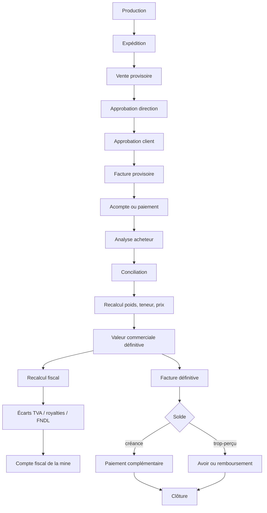

# Workflows — de la production à la clôture

## 1. Chaîne complète

L'amont — production, expédition, vente, approbations — **existe et fonctionne**
depuis le rétablissement des quatre RPC. La conciliation s'ouvre en aval du
paiement et se referme sur la clôture.

## 2. Ouverture d'un dossier

L'utilisateur choisit une opération éligible ; **rien de ce qui est déjà connu
n'est ressaisi**. Sont repris automatiquement : vendeur, acheteur, mine,
expédition et sa date, contrat, lot, poids et teneur déclarés, prix initial,
devise, taux de change, chiffre d'affaires provisoire, facture provisoire, taxes
initiales, paiements et acomptes reçus, documents associés.

Le contrat fournit à lui seul la méthode de prix, la source de cours, les devises,
la teneur de référence et sa tolérance, la méthode d'analyse, le laboratoire, le
délai de contestation et le délai de paiement.

Une opération déjà conciliée définitivement ne peut pas être rouverte : la
contrainte d'unicité l'interdit en base, et le message le dit explicitement plutôt
que de renvoyer une erreur technique.

## 3. Saisie des résultats acheteur

Deux colonnes en vis-à-vis. À gauche, en lecture seule : poids mine, pureté mine,
quantité de métal fin, prix initial, taux de change, chiffre d'affaires initial,
taxes initiales, facture initiale. À droite, en saisie : poids final et son unité,
pureté finale, laboratoire, date et référence de l'analyse, prix ou fixing retenu
et sa date, devise, taux de change si le contrat le prévoit, déductions
contractuelles, observations.

Le rapport d'analyse est joint : document, empreinte si disponible, déposant, date,
référence, type, version. **La validation définitive est refusée** lorsque le
contrat exige un assay et qu'aucune preuve n'est fournie.

Ces valeurs alimentent `snp_analyses_teneur`, qui porte déjà le couple
`teneur_declaree_pct` / `teneur_retenue_pct`.

## 4. Comparaison et écarts

| Paramètre | Initial | Définitif | Écart |
|---|---|---|---|
| Poids | X | Y | Δ |
| Teneur | X | Y | Δ |
| Or fin | X | Y | Δ |
| Prix | X | Y | Δ |
| CA HT | X | Y | Δ |
| TVA | X | Y | Δ |
| Royalties | X | Y | Δ |
| FNDL | X | Y | Δ |
| Total | X | Y | Δ |

Un écart dépassant la tolérance du contrat est mis en évidence et impose une
justification, éventuellement une contre-analyse.

## 5. Calcul de l'or fin et conversions

L'or fin se calcule à partir du poids et de la teneur, dans une unité interne
unique. La conversion once troy / gramme utilise le facteur troy exact —
31,1034768 g — déjà employé par `snp_creer_vente_export`. Ce facteur est centralisé
dans un service testé ; il n'est jamais réécrit dans un composant.

Le prix retenu est celui que le contrat désigne par `methode_prix` : cours du jour
de l'expédition, du résultat d'analyse, fixing convenu, prix contractuel, moyenne.
**Le contrat fait foi.** Le prix effectivement utilisé est figé sur l'opération et
ne varie jamais parce qu'une source externe a changé.

## 6. Validation

En une transaction : instantané des valeurs, écriture commerciale d'ajustement,
écritures fiscales par taxe modifiée, facture définitive, événement d'audit. Un
échec annule l'ensemble. Une seconde validation ne produit aucun doublon.

L'acteur qui valide ne peut pas être celui qui a soumis.

## 7. Facture définitive

Elle affiche distinctement la valeur définitive de la vente, le montant déjà
facturé, le montant déjà reçu, les ajustements, et le solde — restant à recevoir ou
trop-perçu. Elle référence explicitement la facture provisoire, l'expédition, le
contrat et la conciliation.

## 8. Solde

**Créance** : visible sur la facture, le compte client, le tableau de bord et
l'échéancier, jusqu'au règlement.

**Trop-perçu** : matérialisé au ledger commercial, remboursable ou convertible en
avoir imputable sur une vente ultérieure. Toute imputation produit une écriture et
une trace d'audit.

## 9. Circuit exclu

L'achat d'un orpailleur par un comptoir est enregistré pour la traçabilité — poids,
prix, vendeur, comptoir, lieu, date, preuve, paiement, entrée en stock — mais
**n'entre pas dans le moteur de conciliation** et ne déclenche pas
automatiquement TVA, FNDL ni royalties lorsque le cadre applicable ne les prévoit
pas. Ce comportement ne sera pas modifié sans validation juridique.

## 10. Alertes

Assay attendu, délai contractuel dépassé, paiement en retard, conciliation non
faite, écart au-delà du seuil, facture définitive non générée, reliquat impayé,
crédit fiscal inutilisé, contrat proche de l'échéance. Chaque alerte s'appuie sur
une donnée réelle ; aucune n'est décorative.
